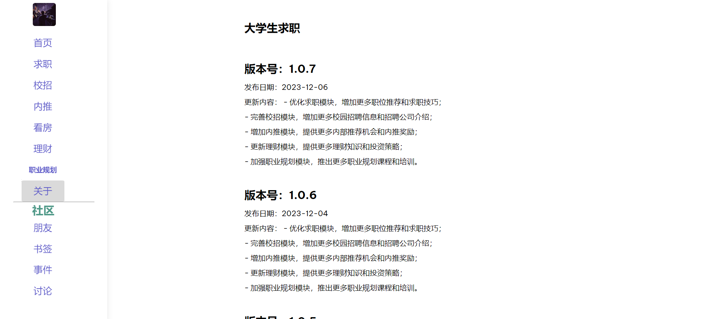

# 大学生求职数据可视化项目

> 本项目总共有8个主要模块，包括**首页、求职、校招、内推、看房、理财、职业规划、关于**。

* 首页 介绍了主要的三大板块，求职、看房、理财，图片如下：

* 求职 通过输入职位、选择城市后可以查看对应城市的岗位个数、岗位地区分布、以及通过树状图查看具体岗位内容

* 校招 包含当前校招的公司及网申时间日历

* 内推 包含内推公司及内推职位链接等相关信息

* 看房 包含广州各区的租房价格，为大学生租房提供信息资讯

* 理财 为大学生理财提供方法论以及相关知识

* 职业规划 接入了文心一言接口，且角色设定为职业规划师，帮助大学生进行职业规划

* 关于 记录了版本更新的时间以及版本号

